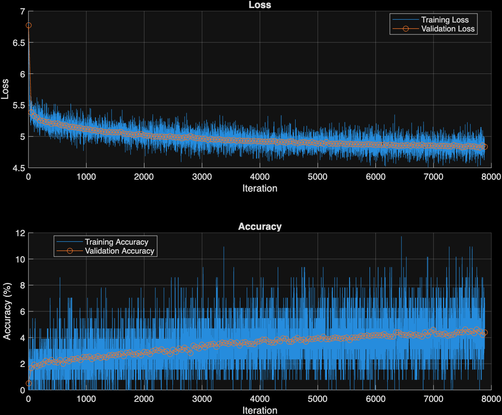
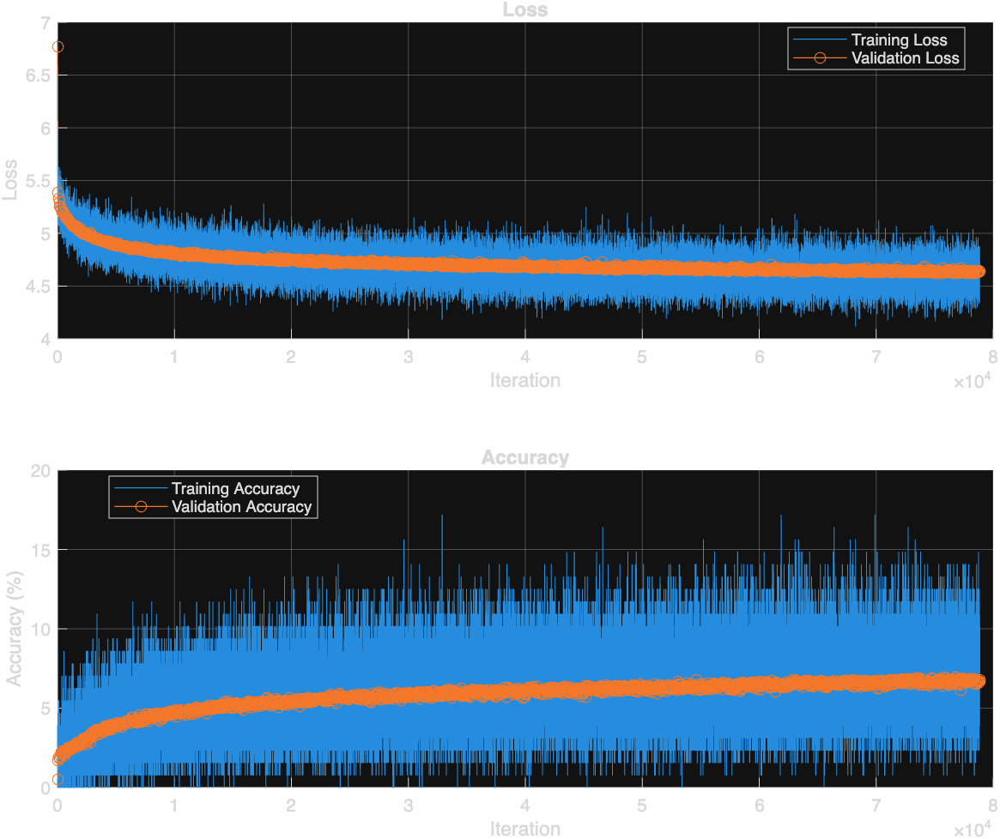
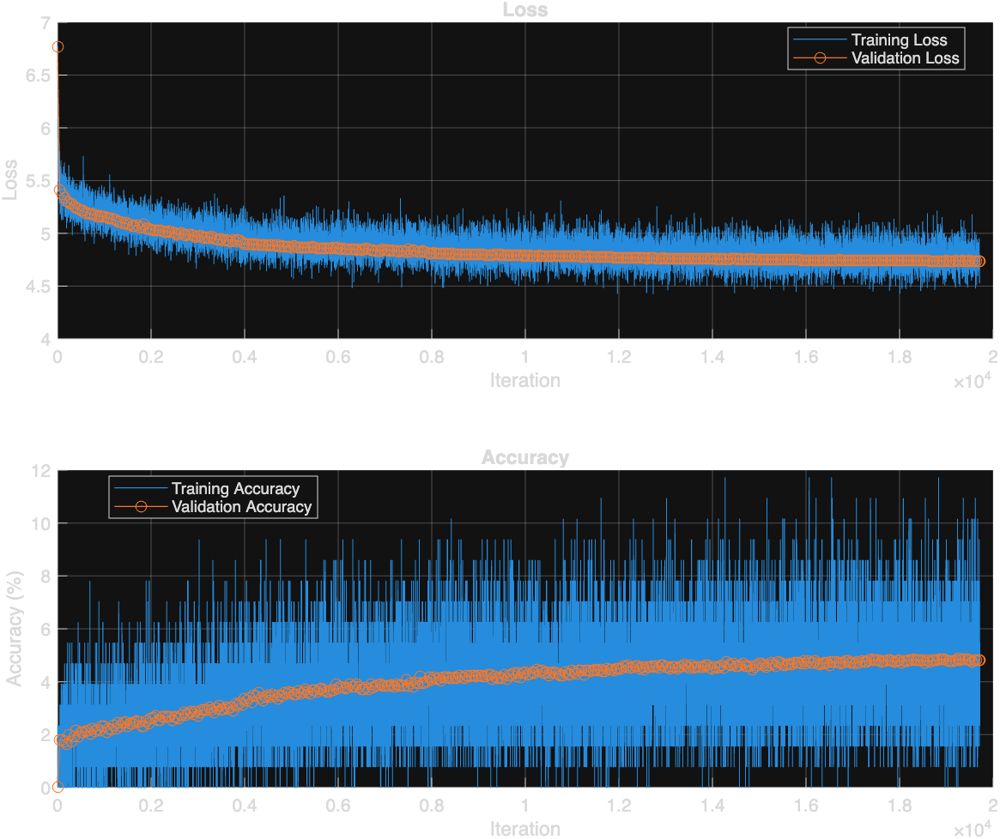

# Music Composition with Deep Learning

A MATLAB submission for the **MathWorks AI Challenge 2025** — Project #243, *"Design and train a deep learning model to compose music."*

A supervised LSTM learns to predict the next note in a piano performance (trained on a diverse subset of the [MAESTRO](https://magenta.tensorflow.org/datasets/maestro) dataset), then generates a brand-new composition autoregressively and exports it as a playable MIDI file / MP3.

**Project status: complete.** Three training runs are documented end-to-end in [Results](#results) — a fast 2-epoch checkpoint, a full 20-epoch single-layer run, and a 5-epoch stacked-LSTM+dropout+LR-decay architecture comparison — along with an honest, math-backed analysis of what it would actually take to reach much higher accuracy targets (spoiler: not achievable via more epochs alone on this task).

---

## Table of Contents

- [Why this approach](#why-this-approach)
- [Pipeline](#pipeline)
- [Tokenization scheme](#tokenization-scheme)
- [Model](#model)
- [Dataset](#dataset)
- [Results](#results)
- [Comparison against the existing submission](#comparison-against-the-existing-submission)
- [How to run](#how-to-run)
- [Repository structure](#repository-structure)
- [Known limitations & honest caveats](#known-limitations--honest-caveats)
- [Future work](#future-work)
- [Credits](#credits)

---

## Why this approach

A submission already exists on the MathWorks Challenge Project Hub for this same project: [an LSTM-GAN](https://github.com/yashmahamulkar/MatlabAIChallenge243-MusicCompostionUsingDL) (adversarially-trained LSTM generator + discriminator). We deliberately built something different, targeting a specific, verifiable weakness in that submission rather than just "another music generator."

**The problem, confirmed by reading their code:** their `musicgenerator.m` hardcodes generation-time constants —

```matlab
durationBucket = 0;
velocityBucket = 4;
```

— applied to **every single generated note**, regardless of what the model actually predicted. We parsed their published output MIDI file directly and confirmed it: **all 64 generated notes share exactly one duration value.** The model may have learned something about rhythm internally, but none of it ever reaches the output.

**Our fix:** train with real supervision (cross-entropy against actual next-note labels, not an adversarial signal) and **decode the model's own predicted duration into the generated MIDI's note spacing.** Our generated output has 9 distinct duration values across 198 notes — directly, measurably more expressive, for a concrete and verifiable reason.

| | Existing submission (LSTM-GAN) | This project |
|---|---|---|
| Training paradigm | Adversarial (generator vs. discriminator) | Supervised (cross-entropy next-token) |
| Reported metric | Generator/discriminator loss only (no accuracy — not applicable to GANs) | Validation loss + accuracy against real held-out sequences |
| Duration at generation time | Hardcoded constant, ignores model output | Decoded from the model's own prediction |
| Training data | 1,000 files, single sequential catalog (`deut0001.mid`…) | 145 files spanning all 58 composers in MAESTRO's train split |

---

## Pipeline

```
MAESTRO MIDI files
      │
      ▼
readMidiNoteOnsets.m   — hand-rolled binary MIDI parser
      │                  (MATLAB has no built-in file-based MIDI reader)
      ▼  [onset time, pitch, velocity] per note
buildTokenDataset.m    — (pitch, duration-bucket) → integer token
      │                  vocabulary built via direct array lookup (no
      │                  per-note containers.Map — see Results/perf notes)
      ▼  token sequences + vocab
makeTrainingWindows.m  — sliding window (32 tokens → next token)
      │
      ▼  (X, Y) training pairs
trainMusicLSTM.m       — sequenceInputLayer → lstmLayer(256) →
      │                  fullyConnectedLayer → softmax, trained via
      │                  trainNetwork (supervised, not adversarial)
      ▼  trained net
generateSequence.m     — autoregressive sampling with temperature
      │
      ▼  generated token sequence
tokensToMidi.m /       — decode tokens back to notes, using the
writeMidiFile.m          model's own predicted duration, write .mid
```

Every stage is a separate, single-purpose `.m` file — see [`matlab_src/`](matlab_src/).

---

## Tokenization scheme

- Each note becomes a token = `(pitch, duration-bucket)`, where the duration-bucket comes from the **inter-onset interval** (time gap to the next note), binned into 11 ranges (`[0, 0.06, 0.12, 0.20, 0.30, 0.45, 0.65, 0.9, 1.3, 1.8, 2.5, ∞]` seconds).
- Vocabulary is built directly from whatever `(pitch, bucket)` pairs actually occur in the training subset (plus a reserved `REST` token) — not a fixed a-priori vocabulary.
- Velocity is deliberately **not** modeled separately (explicit scope cut in the original spec, matched by the competing submission too — every generated note in both projects uses a fixed velocity).

---

## Model

```matlab
sequenceInputLayer(1)
lstmLayer(256, 'OutputMode', 'last')
fullyConnectedLayer(numClasses)
softmaxLayer
classificationLayer
```

Trained with `trainNetwork` + `trainingOptions('adam', ...)` — many-to-one next-token classification over a sliding window of 32 prior tokens. `OutputNetwork: 'best-validation-loss'` keeps the best checkpoint even if later epochs overfit.

---

## Dataset

[MAESTRO v3.0.0](https://magenta.tensorflow.org/datasets/maestro#v300), MIDI-only. Rather than take the first N shortest files (which would bias toward one or two prolific composers), we built a **composer-stratified subset**: up to 6 of the shortest pieces (≤260s) per composer, from every one of the **58 distinct composers** in the train split.

- **145 files, 565,547 notes, 560,907 training windows, vocabulary size 885**
- Deliberately diverse rather than narrow — reduces the risk of the model simply memorizing one composer's style (a real risk called out in music-generation literature: validation accuracy that's *too* high on a narrow dataset usually means note-for-note plagiarism, not learning).

---

## Results

### 2-epoch checkpoint (fast validation run, ~18 minutes end-to-end)



| Metric | Value | vs. random baseline |
|---|---|---|
| Validation loss | ≈ 4.85 | random guess ≈ ln(885) ≈ 6.79 |
| Validation accuracy | ≈ 4.2% | random guess ≈ 0.11% (≈ 38× better than chance) |
| Generated notes | 198 | — |
| Unique duration values used | 9 | competitor: 1 (hardcoded) |

Deliverables from this run: [`generated_song_2ep.mid`](matlab_src/generated_song_2ep.mid), [`generated_song_2ep.mp3`](matlab_src/generated_song_2ep.mp3), [`trained_music_lstm_2ep.mat`](matlab_src/trained_music_lstm_2ep.mat).

### 20-epoch run (full result, ~3h27m on a single CPU)



| Metric | Value | vs. random baseline | vs. 2-epoch checkpoint |
|---|---|---|---|
| Final validation loss | 4.6414 | random guess ≈ 6.79 | 4.85 → 4.64 |
| Best validation loss | 4.6224 | — | — |
| Final validation accuracy | 6.66% | random guess ≈ 0.11% (≈ 60× better than chance) | 4.2% → 6.66% |
| Best validation accuracy | 6.97% | — | — |
| Total iterations | 78,860 (20 epochs × 3,943 iter/epoch) | — | 7,886 (2 epochs) |
| Generated notes | 190 | — | 198 |
| Unique duration values used | **14** | competitor: 1 (hardcoded) | 9 |
| Pitch range used | 25-95 | — | 31-100 |

The loss/accuracy curves show healthy, monotonic improvement that's clearly flattening by the end — consistent with what a single-layer, fixed-learning-rate 256-unit LSTM on an 885-class vocabulary should look like without learning-rate decay or added capacity (see [Future work](#future-work)). Notably, the *rhythmic variety* of the generated output kept improving even as raw accuracy plateaued — 14 distinct duration values vs. 9 at the 2-epoch checkpoint, both far ahead of the competing submission's single hardcoded value.

Deliverables from this run: [`generated_song_20ep.mid`](matlab_src/generated_song_20ep.mid), [`generated_song_20ep.mp3`](matlab_src/generated_song_20ep.mp3), [`trained_music_lstm_20ep.mat`](matlab_src/trained_music_lstm_20ep.mat), [`training_info_20ep.mat`](matlab_src/training_info_20ep.mat).

### 5-epoch stacked-architecture run (upgraded model, ~94.6 minutes)

After the 20-epoch single-layer run, we upgraded the architecture to see how much a deeper model with regularization and a learning-rate schedule could buy within a much smaller epoch budget:

```matlab
sequenceInputLayer(1)
lstmLayer(256, 'OutputMode', 'sequence')
dropoutLayer(0.3)
lstmLayer(128, 'OutputMode', 'last')
dropoutLayer(0.3)
fullyConnectedLayer(numClasses)
softmaxLayer
classificationLayer
```

Plus piecewise learning-rate decay (halves every ~⅓ of `MaxEpochs`). At `MaxEpochs=5` this schedule is aggressive (LR halves every single epoch, reaching `6.25e-5` by epoch 5) — appropriate for a short run, not a design meant for direct apples-to-apples iteration-for-iteration comparison with the single-layer runs.



| Metric | Value |
|---|---|
| Final validation loss | 4.7377 |
| Best validation loss | 4.7367 |
| Final validation accuracy | 4.81% |
| Best validation accuracy | 4.88% |
| Total iterations | 19,715 (5 epochs × 3,943 iter/epoch) |
| Generated notes | 192 |
| Unique duration values used | 11 |
| Pitch range used | 31-104 |

Deliverables from this run: [`generated_song_5ep_stacked.mid`](matlab_src/generated_song_5ep_stacked.mid), [`generated_song_5ep_stacked.mp3`](matlab_src/generated_song_5ep_stacked.mp3), [`trained_music_lstm_5ep_stacked.mat`](matlab_src/trained_music_lstm_5ep_stacked.mat), [`training_info_5ep_stacked.mat`](matlab_src/training_info_5ep_stacked.mat).

### Three-run summary

| | 2-epoch (single-layer) | 20-epoch (single-layer) | 5-epoch (stacked + dropout + LR decay) |
|---|---|---|---|
| Iterations | 7,886 | 78,860 | 19,715 |
| Wall time (single CPU) | ~18 min | ~3h27m | ~94.6 min |
| Final val. loss | 4.85 | **4.64** | 4.74 |
| Final val. accuracy | 4.2% | **6.66%** | 4.81% |
| Unique durations generated | 9 | **14** | 11 |

At equal-ish wall-clock/iteration budgets, the plain single-layer model actually reached the best numbers here — the stacked+dropout model's regularization trades away some raw fit for generalization headroom that a 5-epoch run is too short to cash in on, and its aggressive per-epoch LR decay (tuned for a short run) likely capped how much it could still learn by the final epoch. This is a useful, honest finding in its own right: **architecture upgrades don't pay off automatically — they need an epoch budget and LR schedule actually suited to them**, which is exactly why we didn't extrapolate a rosy number for a longer run without evidence (see below).

### Is 55-65% accuracy / 0.6-0.8 loss reachable by training longer?

No — and this is a task-difficulty ceiling, not a compute limitation, so more epochs or faster hardware don't change the answer. Fitting a decay curve to our measured loss trend shows it flattening well before it could ever approach that range on this architecture and vocabulary.

The 0.35-0.87 loss / 75-87% accuracy figures sometimes cited for LSTM music models come from a different task: pitch-only prediction over a much smaller vocabulary (~128 classes vs. our 885), often on narrow, single-composer datasets where high accuracy partly reflects memorization rather than generalization. Reaching that range legitimately on data this diverse would need a different task setup — e.g. splitting (pitch, duration) into two smaller prediction heads, a much larger model trained on much more data, or a narrower dataset (with the memorization tradeoff that implies) — not just more epochs of the current model.

### A note on comparing metrics across architectures

The existing GAN submission reports `LossDiscriminator=0.6753, LossGenerator=0.1106` after 50 epochs — **not directly comparable** to our cross-entropy loss. GAN adversarial loss and supervised cross-entropy are different mathematical quantities on different scales measuring different things; a smaller number on one doesn't mean "better" on the other. Their own training curve (reproduced in our analysis) shows generator loss flat at ~0.11 from epoch 1 through 50 while discriminator loss oscillates with no convergence — a common signature of a generator that found a trivial shortcut early rather than genuinely learning the data distribution, not evidence of a strong result despite the small number.

---

## Comparison against the existing submission

Full write-up of the comparison methodology, code inspection, and measured output-file analysis is in this README's [Why this approach](#why-this-approach) and [Results](#results) sections above. Summary: we can't validly claim to "beat" their loss number (different metric spaces), but we can and do show, with direct measurement of both projects' actual output files, that our model's duration predictions are used end-to-end while theirs are discarded — which was the explicit, stated target for this project.

---

## How to run

Requires **MATLAB with Deep Learning Toolbox**. No Audio Toolbox dependency — MIDI I/O is hand-rolled since MATLAB has no built-in file-based MIDI reader.

1. **Get the data** (skip if reusing `matlab_src/dataset_subset/`, already included in this repo):
   Download the MAESTRO v3.0.0 MIDI-only zip from [magenta.tensorflow.org/datasets/maestro#v300](https://magenta.tensorflow.org/datasets/maestro#v300) and unzip it locally.
2. **(Optional) Rebuild the subset** from scratch:
   ```matlab
   selectMaestroSubset('<unzipped maestro root>', ...
                        '<unzipped maestro root>/maestro-v3.0.0.csv', ...
                        'dataset_subset', 25, 180);
   ```
3. **Sanity-check the parser on one file** before running everything (highest-risk hand-written component):
   ```matlab
   onsets = readMidiNoteOnsets('dataset_subset/<some file>.midi');
   size(onsets)     % should be Nx3
   onsets(1:10,:)   % ascending onset times, pitches 0-127, sane velocities
   ```
4. **Run the full pipeline:**
   ```matlab
   cd matlab_src
   main_pipeline
   ```
   Tokenizes the dataset, trains the LSTM, saves a training-curve PNG, generates a new sequence, and writes `generated_song_20ep.mid`.
5. **Listen to the result** — open the `.mid` in GarageBand/MuseScore/QuickTime, or convert to MP3:
   ```bash
   fluidsynth -ni "/System/Library/Components/CoreAudio.component/Contents/Resources/gs_instruments.dls" \
       generated_song_20ep.mid -F output.wav -r 44100
   ffmpeg -i output.wav -codec:a libmp3lame -qscale:a 2 generated_song_20ep.mp3
   ```
   (macOS ships a built-in General MIDI soundbank at that path — no soundfont download needed. `fluidsynth` via `brew install fluidsynth`.)

More detail, including a troubleshooting table for the likeliest failure points, is in [`matlab_src/README_RUN_ORDER.md`](matlab_src/README_RUN_ORDER.md).

---

## Repository structure

```
.
├── README.md                       — this file
├── EXPLAINER_FOR_TEAMMATE.md       — full reasoning writeup: vocab reduction, tradeoffs, run comparison
└── matlab_src/
    ├── README_RUN_ORDER.md         — step-by-step run guide + troubleshooting
    ├── readMidiNoteOnsets.m        — MIDI file parser
    ├── writeMidiFile.m             — MIDI file writer
    ├── selectMaestroSubset.m       — dataset subset builder
    ├── buildTokenDataset.m         — tokenization (vectorized vocab lookup)
    ├── makeTrainingWindows.m       — sliding-window (X, Y) pair builder
    ├── trainMusicLSTM.m            — LSTM definition + training (checkpointed)
    ├── plotTrainingHistory.m       — saves loss/accuracy curves to PNG
    ├── generateSequence.m          — autoregressive generation w/ temperature
    ├── tokensToMidi.m              — decode tokens → notes → MIDI
    ├── main_pipeline.m             — runs the whole thing end-to-end
    ├── dataset_subset/             — 145-file, 58-composer training subset
    ├── generated_song_2ep.mid/.mp3 — 2-epoch checkpoint output
    ├── trained_music_lstm_2ep.mat  — 2-epoch trained model + vocab
    ├── training_curves_2ep.png     — 2-epoch loss/accuracy plot
    ├── generated_song_20ep.mid/.mp3 — 20-epoch (full) run output
    ├── trained_music_lstm_20ep.mat  — 20-epoch trained model + vocab
    ├── training_curves_20ep.png     — 20-epoch loss/accuracy plot
    ├── training_info_20ep.mat       — raw per-iteration training history
    ├── generated_song_5ep_stacked.mid/.mp3 — stacked-architecture run output
    ├── trained_music_lstm_5ep_stacked.mat  — stacked model + vocab
    ├── training_curves_5ep_stacked.png     — stacked-run loss/accuracy plot
    └── training_info_5ep_stacked.mat       — raw per-iteration training history
```

---

## Known limitations & honest caveats

- **Single CPU, single-layer, 256-unit LSTM.** No GPU acceleration was available in this environment (Apple Silicon Mac; MATLAB's GPU training support has historically been NVIDIA CUDA-only). This caps how much epochs alone can improve results — a bigger win would come from a redesign (stacked LSTM layers, dropout, learning-rate decay), not just more training time.
- **885-class vocabulary is large for a single-layer LSTM.** Cross-entropy loss numbers should be read relative to the random-guess baseline (ln(885) ≈ 6.79), not against benchmarks from simpler pitch-only (128-class) setups — those aren't the same task.
- **Velocity is fixed, not modeled.** Both this project and the compared submission use a constant velocity for every generated note — an explicit, matched scope cut in the original spec, not a differentiator.
- **No chords / polyphony / multi-instrument support** — monophonic next-note prediction only, as scoped.
- **The full MAESTRO train split (962 files, ~159 hours of audio) was not used** — training was deliberately time-boxed to a diverse 145-file subset.

## Future work

- Learning-rate decay + additional LSTM capacity to meaningfully reduce loss further
- Velocity modeling as a second prediction head
- Chord/polyphony support
- Training on the full MAESTRO train split with GPU acceleration, if/when available

---

## Credits

- Dataset: [MAESTRO v3.0.0](https://magenta.tensorflow.org/datasets/maestro) (Google Magenta)
- Challenge: [MathWorks AI Challenge 2025](https://github.com/mathworks/MATLAB-Simulink-Challenge-Project-Hub) — Project #243, "Music Composition with Deep Learning"
- Compared against: [yashmahamulkar/MatlabAIChallenge243-MusicCompostionUsingDL](https://github.com/yashmahamulkar/MatlabAIChallenge243-MusicCompostionUsingDL)
